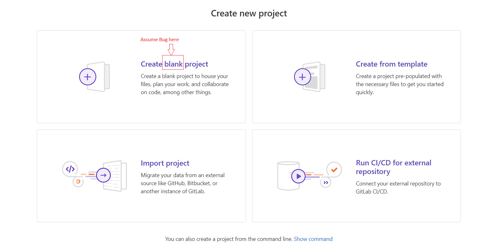

## Summary (Summarize the bug encountered concisely)

The bug encountered is a misleading discrepancy between the expected text displayed on the project creation page

## Steps to reproduce     

Navigate to the project creation page
Observe the displayed text

## What is the current bug behavior?

Text says 'Create Black Project'   

## What is the expected correct behavior?

Text should say 'Create Blank Project' 
     
## Relevant logs and/or screenshots

    

## Possible fixes

Fix the typo in the code to corect the displayed text

## Whom do you report/ Assign To/ Tags

/label ~bug ~reproduced ~needs-investigation 
/cc @project-manager 
/assign @qa-tester

## Priority

High priority, very misleading      
